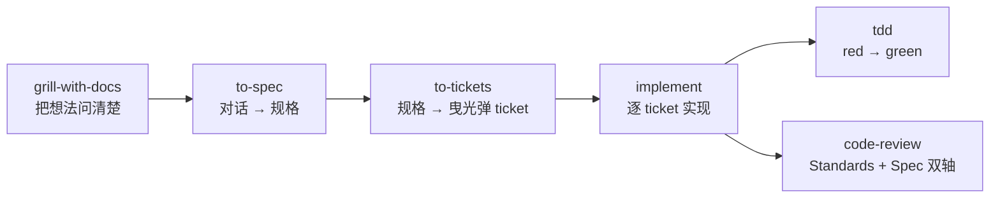
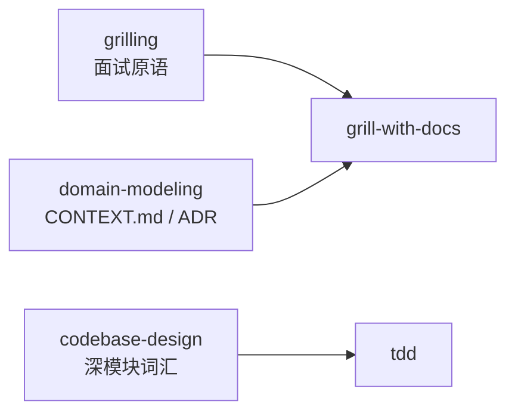
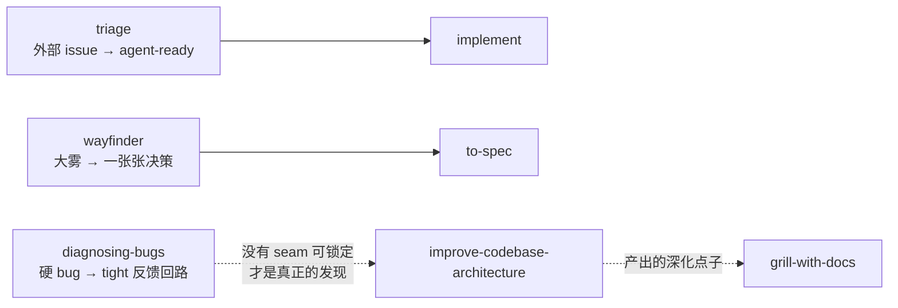
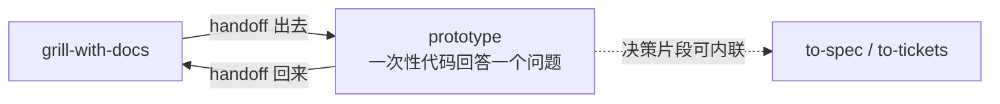

# 技能依赖图（分层版）

整套体系不需要一张大图。读法是从主链路开始，每层只引入"没有它、上面那层就不成立"的技能——读到哪一层够用，就可以停在哪一层。

- **只想用起来** → 读第 1 层
- **想知道输入从哪来** → 加读第 2 层
- **想理解体系为什么能自转** → 加读第 3 层
- **想知道主链路之外还有什么** → 第 4 层的分族概括，每条一行
- 词汇（frontier、seam、曳光弹……）查 [`PRIMITIVES.md`](./PRIMITIVES.md)；`ask-matt` 的 SKILL.md 是这张图的路由版原文

---

## 第 1 层：主链路（idea → ship）

所有工作的主路。五个技能一条链，外加一个一次性前置配置。

- 箭头是**产物交接**： grilling 的产出喂给 spec，spec 拆成 ticket，ticket 驱动实现。
- `implement` 内部驱动 `tdd`（一次一个红绿切片），收尾必跑 `code-review`。
- **单会话能装下的工作跳过中间两站**：grill 完直接 `implement`。
- 前置：`setup-matt-pocock-skills` 跑一次，配好 issue 跟踪器和标签，`to-spec`/`to-tickets`/`code-review` 才能工作。

## 第 2 层：地基（词汇原语层）

主链路站在三个 model-invoked 的词汇技能上。它们不跑流程，只提供语言——被调用的方式都是 `call the Skill tool`。

- `grill-with-docs` 本体只有一行：`grilling` + `domain-modeling` 一起调。
- `tdd` 在"seam 该落在哪"存疑时调 `codebase-design`。
- 第 3 层的入口技能（triage、wayfinder 等）也站在同一块地基上——`grilling + domain-modeling` 是固定搭配，到处成对出现。

## 第 3 层：入口斜坡（工作从哪来）

主链路的输入不止"我有一个想法"。三个入口，各自在不同情形下点火，然后**并入主链路**：

- **triage**：别人报的 bug / 需求 → 烤成 agent-ready issue → `implement` 领取。（自己 `to-tickets` 拆的 ticket 已经 agent-ready，**不要**再过 triage。）
- **wayfinder**：大到看不清路的工程 → 只产决策不产交付，雾散后在 `to-spec` 并入主链路。
- **diagnosing-bugs**：bug 修不动往往是没有好的 seam——这时真正的产物是转交给 `improve-codebase-architecture` 的架构发现。
- **improve-codebase-architecture**：平时扫出的深化机会，作为新想法喂回 `grill-with-docs`——这是体系的**维护回流**，让主链路常转常新。

## 第 4 层：主链路上的绕行

一个分支：问题在纸面上谈不拢（状态模型、UI 长什么样），就绕出去做个一次性原型，再带着答案回来。

`handoff` 是这座桥本身：原型住在自己的目录/分支里，正好需要一份可携带的交接文档。

---

## 第 5 层：主链路之外的分族

以下都不在主链路上，按族概括，一族一行结构：

| 族 | 成员与结构 | 一句话 |
|---|---|---|
| **提问族** | `grill-me`、`grill-with-docs` → 都= `grilling`（± `domain-modeling`）；`to-questionnaire` 是它的反向（问别人） | 一切"把想法问清楚"的入口 |
| **写作族** | `writing-fragments`（explore）→ `writing-shape` / `writing-beats`（exploit） | 先采碎片，再从素材堆塑形；借用 grilling 纪律 |
| **交接族** | `handoff`（写文件）、`claude-handoff`（直接起后台 agent） | 同一交接文档的两种投递方式 |
| **学习族** | `teach` | 多会话教学，工作区即状态（MISSION/课程/学习记录） |
| **自动化族** | `loop-me` | 把生活里的 loop 烤成 workflow 规格；借用 grilling 纪律 |
| **元技能** | `ask-matt`（本图的路由版）、`writing-for-agents`（写技能/文档的参考） | 关于体系本身的技能 |

## 边角：独立工具

与主链路无依赖，需要时单点取用，不值得画进任何图：

- `resolving-merge-conflicts` — 已在冲突中时的解冲突纪律
- `wizard` — 只有人类能做的步骤（开账号、配密钥）生成向导脚本
- `research` — 把阅读跑腿委托给后台 agent（产物可喂给 grill-with-docs）
- `wait-what` — "刚才那段没看懂"，用 CONTEXT.md 词汇重讲一遍
- `setup-ts-deep-modules` — 用 dependency-cruiser 把包强制成深模块（借用 codebase-design 词汇）
- misc 桶（`git-guardrails-claude-code`、`migrate-to-shoehorn`、`scaffold-exercises`、`setup-pre-commit`）— 仓库工具，与体系无关
